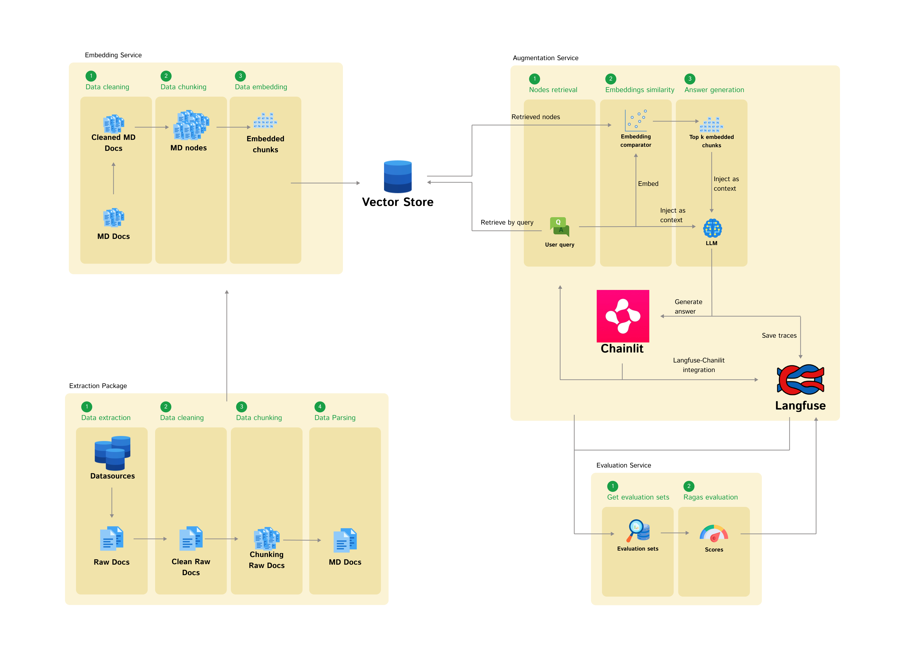

# RAG Blueprint

A comprehensive open-source framework for building production-ready Retrieval-Augmented Generation (RAG) systems. This blueprint simplifies the development of RAG applications while providing full control over performance, resource usage, and evaluation capabilities.

Open-source community offers a wide range of RAG-related frameworks focus on the specific area - monitoring, visualization or processing. While building or buying RAG systems has become increasingly accessible, deploying them as production-ready data products remains challenging. Our framework bridges this gap by providing a streamlined development experience with easy configuration and customization options, while maintaining complete oversight of performance and resource usage.

It comes with built-in monitoring and observability tools for better troubleshooting, integrated LLM-based metrics for evaluation, and human feedback collection capabilities. Whether you're building a lightweight knowledge base or an enterprise-grade application, this blueprint offers the flexibility and scalability needed for production deployments.

<div align="center">
  
  <p><em>Figure 1: High-level architecture of the RAG Blueprint framework showing the main components and data flow</em></p>
</div>

## 🚀 Features

- **Multiple Knowledge Base Integration**: Seamless extraction from several Data Sources(Confluence, Notion, PDF)
- **Wide Models Support**: Availability of numerous embedding and language models
- **Vector Search**: Efficient similarity search using vector stores
- **Interactive Chat**: User-friendly interface for querying knowledge on [Chainlit](https://chainlit.io/)
- **Performance Monitoring**: Query and response tracking with [Langfuse](https://langfuse.com/)
- **Evaluation**: Comprehensive evaluation metrics using [RAGAS](https://docs.ragas.io/en/stable/)
- **Setup flexibility**: Easy and flexible setup process of the pipeline

## 🛠️ Tech Stack

### Core
[Python](https://www.python.org/) • [LlamaIndex](https://www.llamaindex.ai/) • [Chainlit](https://chainlit.io/) • [Langfuse](https://langfuse.com/) • [RAGAS](https://docs.ragas.io/)

---

### Data Sources
[Notion](https://developers.notion.com/) • [Confluence](https://developer.atlassian.com/cloud/confluence/rest/v2/intro/#about) • PDF files

---

### Embedding Models
[VoyageAI](https://www.voyageai.com/) • [OpenAI](https://openai.com/) • [Hugging Face](https://huggingface.co/)

---

### Language Models
[OpenAI](https://openai.com/) • Any [OpenAI](https://openai.com/) API compatible models

---

### Vector Stores
[Qdrant](https://qdrant.tech/) • [Chroma](https://www.trychroma.com/) • [PGVector](https://github.com/pgvector)


---

### Infrastructure
[PostgreSQL](https://www.postgresql.org/) • [Docker](https://www.docker.com/)


## 🚀 Quickstart

Check the detailed [Quickstart Setup](https://feld-m.github.io/rag_blueprint/quickstart/quickstart_setup/)

## 🏗️ Architecture

### Data Flow

1. **Extraction**:
   - Fetches content from respective data sources
   - Preprocess retrieved resources and parse it to markdown

2. **Embedding**:
   - Applies markdown aware splitting
   - Embeds final nodes using the selected embedding model
   - Saves the embeddings in the selected vector store

3. **Augmentation**
   - Defines retrieval and augmentation pipeline encapusalted in a chat engine
   - Integrates Chainlit for UI interface
   - Integrates Langfuse for observability of generated responses and user queries

3. **Evaluation**:
   - Uses Chainlit and Langfuse platforms for gathering human feedback
   - Employs Ragas package for evaluating perfomance of current setup

For more info refer to specific readmes of [Extraction](/src/extraction/README.md), [Embedding](/src/embedding/README.md), [Augmentation](/src/augmentation/README.md) and [Evaluation](/src/evaluation//README.md).

### Integrations

For user interface the codebase uses [Chainlit](https://chainlit.io/), which is integrated with [Langfuse](https://langfuse.com/) responsible for observability and tracing of the system. Moreover, integration enables building evaluation datasets based on the user feeback regarding the system answers. Feedback is saved in Langfuse datasets and later used by [Evaluation](/src/evaluation//README.md) module.

## 📁 Project Structure

```
.
├── build/            # Build and deployment scripts
│   └── workstation/  # Build scripts for workstation setup
├── configurations/   # Configuration and secrets files
├── data/             # Data for local testing
├── res/              # Assets
└── src/              # Source code
    ├── augmentation/   # Chainlit, Langfuse, and RAG processing components
    ├── core/           # Base package
    ├── extraction/     # Data sources extraction
    ├── embedding/      # Data embedding
    └── evaluate/       # Evaluation system
├── tests/            # Unit tests
```

## 📚 Documentation

For detailed documentation on setup, configuration, and development:
- [Documentation Site](https://feld-m.github.io/rag_blueprint/)
- [Quickstart Setup](https://feld-m.github.io/rag_blueprint/quickstart/quickstart_setup/)
